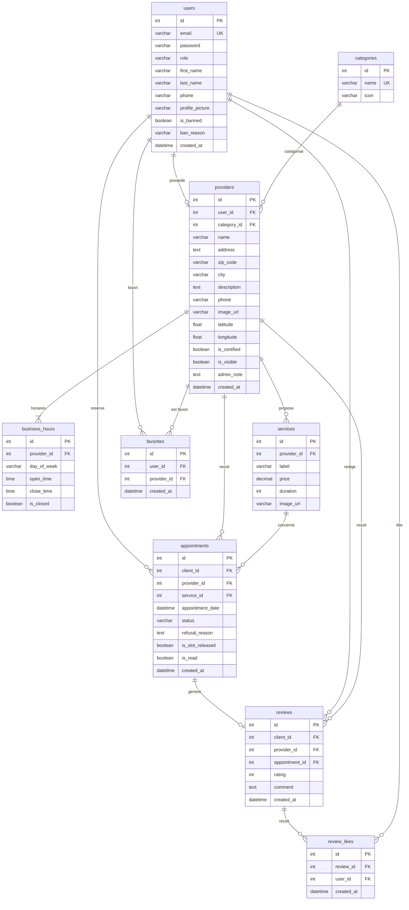

# MCD / MLD — O'RDV

## MLD (Modèle Logique de Données)

## Contraintes notables

| Contrainte | Table | Detail |
|---|---|---|
| Unique | `users.email` | Un email = un compte |
| Unique | `providers.user_id` | Un user = un seul profil pro |
| Unique | `reviews.appointment_id` | Un RDV = un seul avis |
| Unique | `review_likes (review_id, user_id)` | Un user ne peut liker qu'une fois |
| Unique | `favorites (user_id, provider_id)` | Pas de doublon en favoris |
| Cascade | `providers → users` | Suppression user = suppression pro |
| Cascade | `appointments → users, providers, services` | Suppression en cascade |

## Enums

| Enum | Valeurs |
|---|---|
| `role` | `user`, `pro`, `admin` |
| `status` | `pending`, `confirmed`, `cancelled`, `cancelled_by_pro`, `completed` |
| `day_of_week` | `monday`, `tuesday`, `wednesday`, `thursday`, `friday`, `saturday`, `sunday` |
