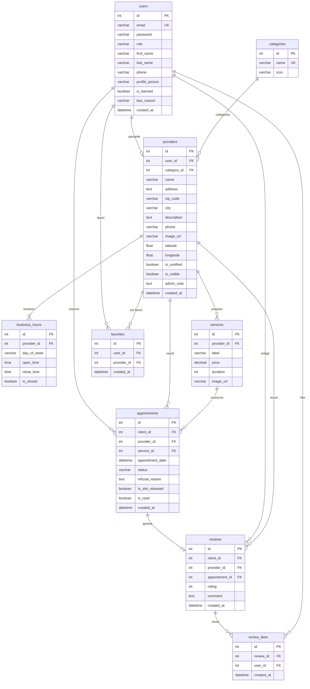

# MCD / MLD — O'RDV

## MCD (Modèle Conceptuel de Données — MERISE)

Le MCD décrit les entités métier et leurs associations, indépendamment de toute implémentation technique.

### Entités et attributs

| Entité | Attributs principaux |
|--------|----------------------|
| **UTILISATEUR** | #id_utilisateur, email, mot_de_passe, prénom, nom, téléphone, photo, rôle {user, pro, admin}, banni, raison_bannissement |
| **PRESTATAIRE** | #id_prestataire, nom, description, adresse, code_postal, ville, téléphone, image, latitude, longitude, certifié, visible, note_admin |
| **CATEGORIE** | #id_categorie, libellé, icône |
| **SERVICE** | #id_service, libellé, prix, durée (min), image |
| **HORAIRE** | #id_horaire, jour_semaine, heure_ouverture, heure_fermeture, est_fermé |
| **RENDEZ_VOUS** | #id_rdv, date_heure, statut {en_attente, confirmé, annulé, annulé_pro, terminé}, raison_refus, créneau_libéré, lu |
| **AVIS** | #id_avis, note (1-5), commentaire, date_création |

### Associations MERISE

```
UTILISATEUR ──(1,1)── POSSEDE ──(0,1)── PRESTATAIRE
     Le même compte peut être client ET gérer un shop (rôle pro)

CATEGORIE ──(1,1)── APPARTIENT ──(0,n)── PRESTATAIRE
     Un prestataire appartient à une seule catégorie

PRESTATAIRE ──(1,1)── DEFINI ──(1,n)── HORAIRE
     Chaque prestataire a 7 créneaux horaires (un par jour de la semaine)

PRESTATAIRE ──(1,1)── PROPOSE ──(0,n)── SERVICE
     Un service appartient à un seul prestataire

UTILISATEUR ──(0,n)── RESERVE ──(0,n)── PRESTATAIRE
  via RENDEZ_VOUS (#id_rdv, date_heure, statut)
  avec SERVICE ──(1,1)── CONCERNE ──(0,n)── RENDEZ_VOUS

RENDEZ_VOUS ──(1,1)── GENERE ──(0,1)── AVIS
     Un RDV ne peut avoir qu'un seul avis

UTILISATEUR ──(0,n)── REDIGE ──(0,n)── PRESTATAIRE
  via AVIS

UTILISATEUR ──(0,n)── AIME ──(0,n)── AVIS
  via LIKE_AVIS (association pure, pas d'attribut)

UTILISATEUR ──(0,n)── MET_EN_FAVORI ──(0,n)── PRESTATAIRE
  via FAVORI (association pure, date_ajout)
```

### Cardinalités clés

| Association | Lecture |
|-------------|---------|
| UTILISATEUR (1,1) — POSSEDE — (0,1) PRESTATAIRE | Un utilisateur possède au plus 1 profil pro ; un profil pro appartient à exactement 1 utilisateur |
| PRESTATAIRE (1,1) — PROPOSE — (0,n) SERVICE | Un prestataire peut proposer plusieurs services ; un service appartient à un seul prestataire |
| UTILISATEUR (0,n) — RESERVE — RENDEZ_VOUS — RECU — (0,n) PRESTATAIRE | Un client peut avoir plusieurs RDV chez différents prestataires |
| RENDEZ_VOUS (1,1) — GENERE — (0,1) AVIS | Un RDV donne lieu à au plus 1 avis ; un avis est lié à exactement 1 RDV |

---

## MLD (Modèle Logique de Données)



## Contraintes notables

| Contrainte | Table | Detail |
|---|---|---|
| Unique | `users.email` | Un email = un compte |
| Unique | `providers.user_id` | Un user = un seul profil pro |
| Unique | `reviews.appointment_id` | Un RDV = un seul avis |
| Unique | `review_likes (review_id, user_id)` | Un user ne peut liker qu'une fois |
| Unique | `favorites (user_id, provider_id)` | Pas de doublon en favoris |
| Cascade | `providers → users` | Suppression user = suppression pro |
| Cascade | `appointments → users, providers, services` | Suppression en cascade |

## Enums

| Enum | Valeurs |
|---|---|
| `role` | `user`, `pro`, `admin` |
| `status` | `pending`, `confirmed`, `cancelled`, `cancelled_by_pro`, `completed` |
| `day_of_week` | `monday`, `tuesday`, `wednesday`, `thursday`, `friday`, `saturday`, `sunday` |
