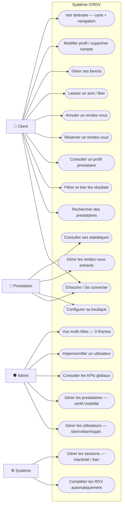
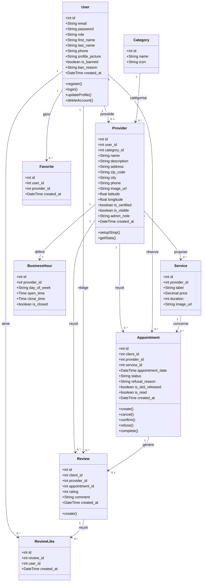
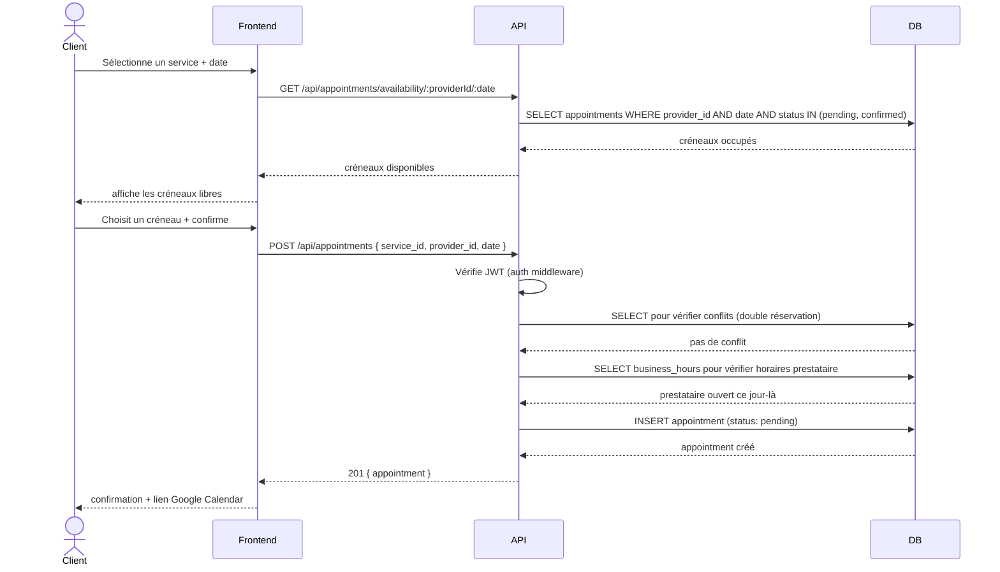
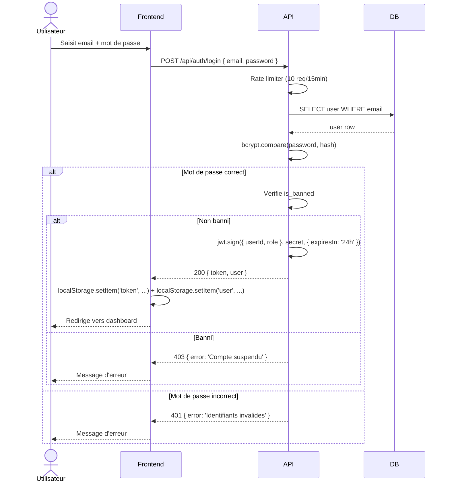
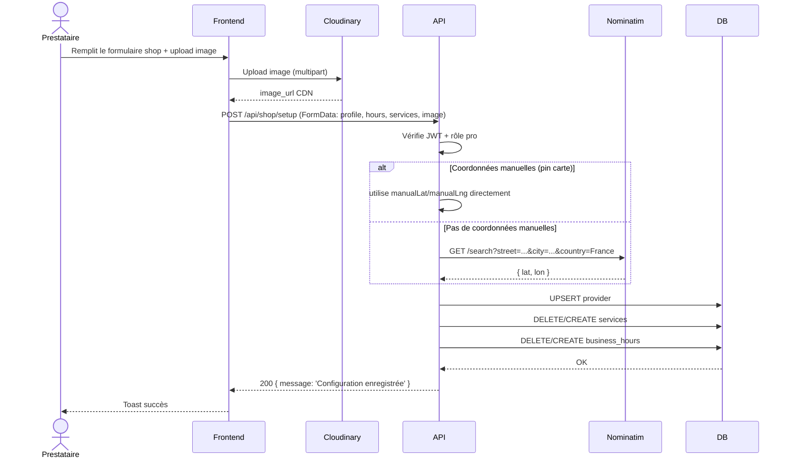
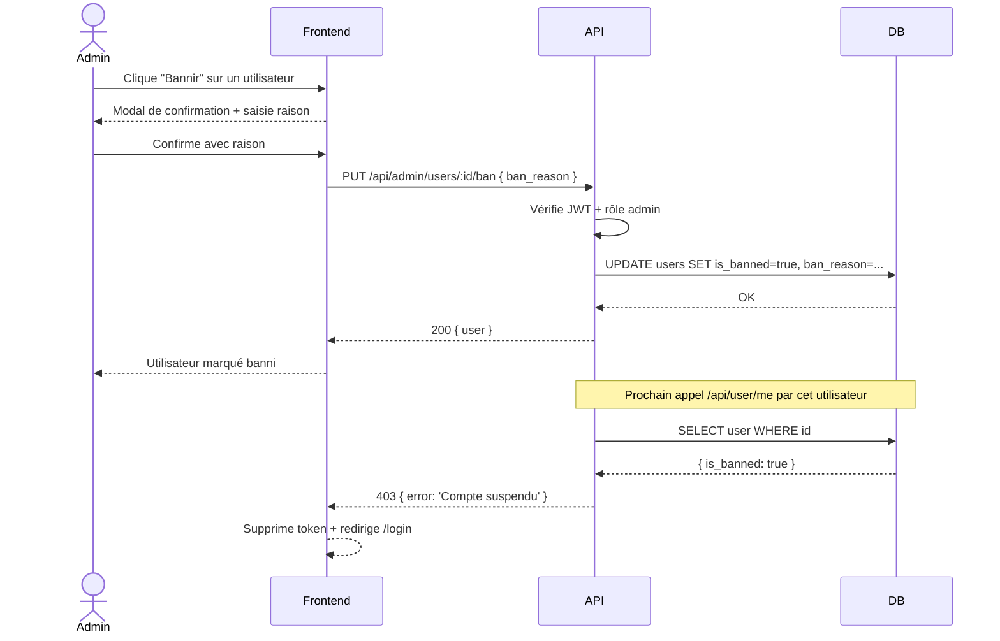

# Diagrammes UML — O'RDV

## 1. Diagramme de cas d'utilisation

### Acteurs

| Acteur | Rôle |
|--------|------|
| **Client** | Visiteur authentifié qui recherche et réserve des prestations |
| **Prestataire** | Professionnel qui gère son shop et ses rendez-vous |
| **Administrateur** | Modère la plateforme, gère les utilisateurs |
| **Système** | Déclenche des actions automatiques (completion RDV, sessions) |

### Cas d'utilisation par acteur

#### Client
- S'inscrire / Se connecter (email ou Google OAuth)
- Rechercher des prestataires (par nom, ville, catégorie)
- Filtrer et trier les résultats (distance, note, "ouvert maintenant")
- Consulter le profil d'un prestataire
- Réserver un rendez-vous (service + date + créneau)
- Annuler un rendez-vous
- Laisser un avis (après RDV terminé)
- Liker/unliker un avis
- Gérer ses favoris
- Modifier son profil et son mot de passe
- Supprimer son compte (RGPD)
- Voir l'itinéraire vers un prestataire (carte + navigation)
- Ajouter un RDV à Google Calendar

#### Prestataire (hérite du Client)
- Configurer son shop (nom, description, adresse, horaires, services, images)
- Valider ou refuser un rendez-vous (avec motif)
- Consulter ses statistiques (CA, taux d'occupation, nouveaux clients)
- Consulter les avis reçus
- Définir la position de son shop sur la carte

#### Administrateur (hérite du Prestataire)
- Lister et gérer les utilisateurs (bannir/débannir/supprimer)
- Lister et gérer les prestataires (certifier, rendre visible/invisible, ajouter une note)
- Consulter les KPIs globaux
- Impersonifier n'importe quel utilisateur (30 min)
- Accéder à la vue multi-rôles (3 iframes simultanées)

#### Système
- Marquer automatiquement les RDV comme "terminés" après leur heure de fin
- Déconnecter l'utilisateur après 30 min d'inactivité
- Déconnecter l'utilisateur si son token expire ou s'il est banni

### Diagramme de cas d'utilisation

---

## 2. Diagramme de classes

---

## 3. Diagramme de séquence — Réservation d'un rendez-vous

---

## 4. Diagramme de séquence — Authentification (email/password)

---

## 5. Diagramme de séquence — Configuration du shop (prestataire)

---

## 6. Diagramme de séquence — Modération admin (bannissement)

